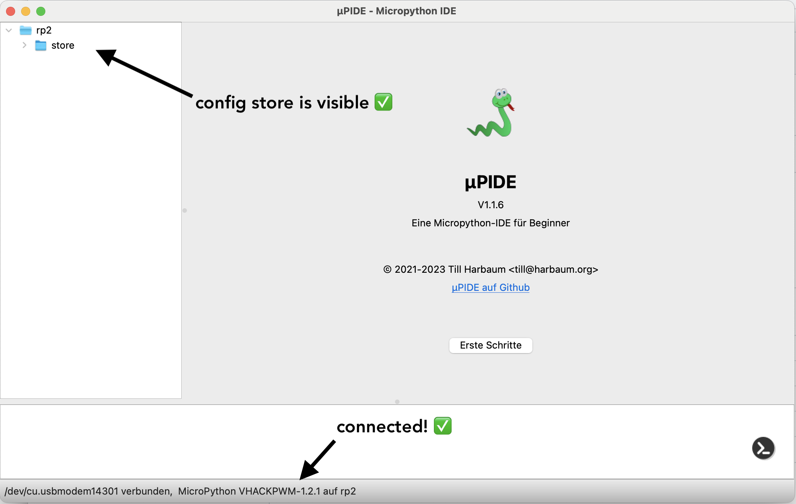
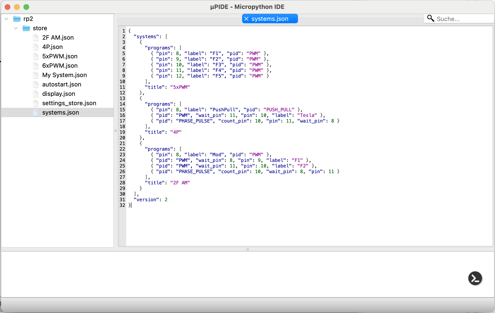
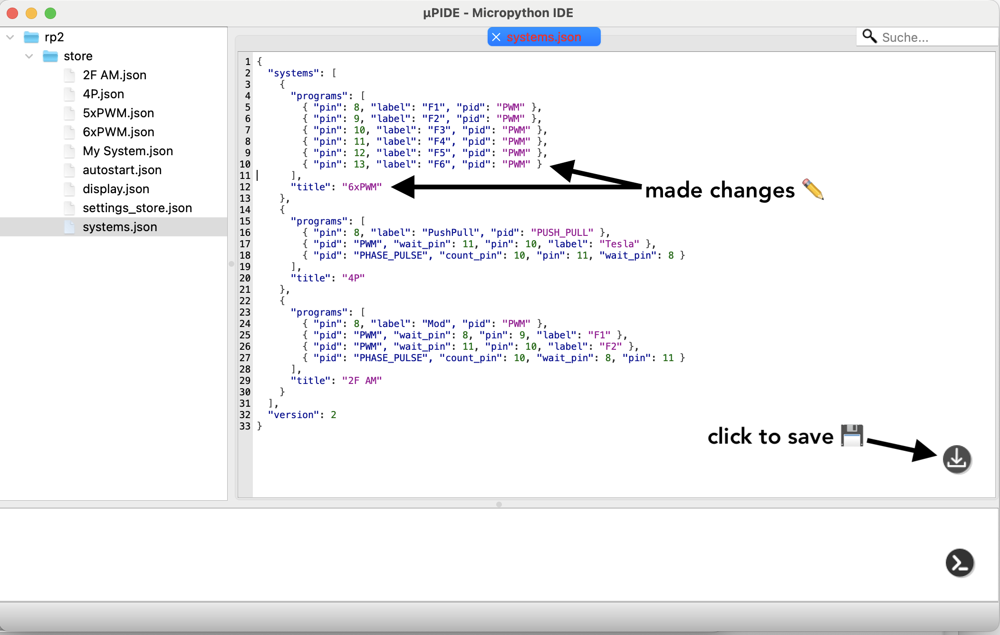
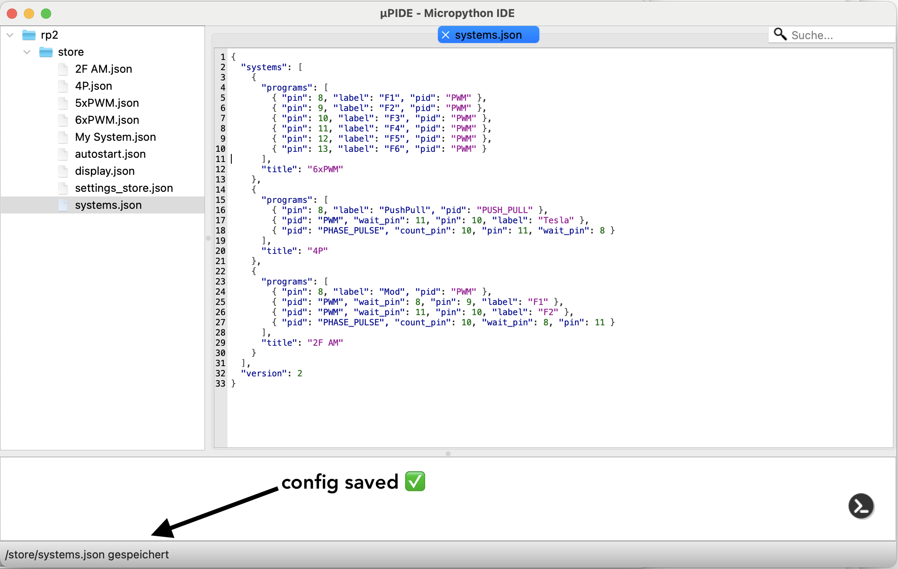

import Link from "next/link";

# HackPWM Systems

## Concept

The basic idea is to allow the user to create powerful PWM Systems with a small, but flexible set of Program Blocks which can depend on other signals, so it can provide continuous PWM signal output. Pwm signals which depend on other signal level (high or low), phase shifting, signal counting etc.

## Built-in Program Blocks

Program Blocks can be created by advanced users.
See source code: https://github.com/webdeb/nanoshim/blob/hackpwm/src/hackpwm/programs.py

### PWM

- `pid` = "PWM"

Configugration parameters:

- `pin` The signal out pin, can be one of OUT1, OUT2, .., OUT6

- `wait_pin` (optional) The pin which enables the PWM Program to run a full cycle

- `wait_level` (optional, default=1) The level of the `wait_pin` which enables the PWM.

### PUSH PULL

The Push Pull program represents mostly the same as the PWM Program and supports the config parameters, but different from the **PWM** program it runs first the full period for the configured `pin` and then it runs the same period as `pin+1`. This is why you should pay attention to which `pin` you define.

- `pid` = "PUSH_PULL"

Configugration parameters:

- `pin` The **first** signal out pin, can be one of "OUT1", "OUT2", .. "OUT5". Keep in mind, that the **PUSH PULL** Program will aquire _pin+1_ automatically.

- `wait_pin` (optional) The pin which enables the PWM Program to run a full cycle

- `wait_level` (optional, default=1) The level of the `wait_pin` that enables the PUSH PULL Program.

### PHASE PULSE

The Phase Pulse program requires a reference signal run (wait_pin). When the configured level of the reference signal is available, it will wait for **x** cpu cycles and then change to high for **y** cpu cycles. Before closing its cycle, it will wait for the inverted `wait_level` so it assured that the Phase Pulse Program runs only once, for each period of the ref signal. To Perform multiple pulses, one could use a `PWM` signal with the `wait_pin` referencing the Phase Pulse signal. This is a first-class feature, so the Phase Pulse Program offers `count_pin` configuration option, which allows the user to set the amount of pulses it should be in high mode.

- `pid` = "PHASE_PULSE"

Configugration parameters:

- `pin` The **first** signal out pin, can be one of "OUT1", "OUT2", .. "OUT5". Keep in mind, that the **PUSH PULL** Program will acquire _pin+1_ automatically.

- `wait_pin` (optional) The pin which enables the PWM Program to run a full cycle

- `wait_level` (optional, default=1) The level which of the `wait_pin` which enables the PWM to run.

- `count_pin` (optional) If set, the user can change the **amount of pulses** of the referenced pin, instead of the usual duty cycle as absolute time.

### Example System configurations

#### Modulation

```json
{
  "title": "Mod example",
  "programs": [
    { "label": "Modulation", "pid": "PWM", "pin": "OUT1" },
    { "label": "HF", "pid": "PWM", "wait_pin": "OUT1", "pin": "OUT2" }
  ]
}
```

#### 4P System

The same system as demonstrated <Link className="font-semibold" href="/hackpwm">here</Link>

```json
{
  "title": "4P",
  "programs": [
    {
      "pid": "PUSH_PULL",
      "label": "Push Pull",
      "pin": "OUT1"
    },
    {
      "pid": "PWM",
      "label": "Tesla",
      "pin": "OUT3",
      "wait_pin": "OUT4"
    },
    {
      "pid": "PHASE_PULSE",
      "pin": "OUT4",
      "wait_pin": "OUT1",
      "count_pin": "OUT3"
    }
  ]
}
```

The default `/store/systems.json` includes the program 6xPWM, 4P and 2F AM. It is using the integer numbers like **8** (OUT1) instead of "OUT1" which are internally mapped to the actual pin number.
You can use it for reference or reset of your device.

```json
{
  "systems": [
    {
      "programs": [
        { "pin": 8, "label": "F1", "pid": "PWM" },
        { "pin": 9, "label": "F2", "pid": "PWM" },
        { "pin": 10, "label": "F3", "pid": "PWM" },
        { "pin": 11, "label": "F4", "pid": "PWM" },
        { "pin": 12, "label": "F5", "pid": "PWM" },
        { "pin": 13, "label": "F6", "pid": "PWM" }
      ],
      "title": "6xPWM"
    },
    {
      "programs": [
        { "pin": 8, "label": "PushPull", "pid": "PUSH_PULL" },
        { "pid": "PWM", "wait_pin": 11, "pin": 10, "label": "Tesla" },
        { "pid": "PHASE_PULSE", "count_pin": 10, "pin": 11, "wait_pin": 8 }
      ],
      "title": "4P"
    },
    {
      "programs": [
        { "pin": 8, "label": "Mod", "pid": "PWM" },
        { "pid": "PWM", "wait_pin": 8, "pin": 9, "label": "F1" },
        { "pid": "PWM", "wait_pin": 11, "pin": 10, "label": "F2" },
        { "pid": "PHASE_PULSE", "count_pin": 10, "wait_pin": 8, "pin": 11 }
      ],
      "title": "2F AM"
    }
  ],
  "version": 2
}
```

## Upload config to the device:

You can connect and upload files to the board in many ways, for this demonstration I am using **uPIDE**, which is open source, very simple and is perfect for beginners.

You can download it here https://github.com/harbaum/upide/releases There are precompiled bundles for MacOS, Windows and Linux.

### Example of uPIDE

1. Connect your HackPWM with the Computer over USB
2. Start the Program uPIDE

The program first searches for serial ports and after it has found the device it'll look similar to the next picture. In the bottom you will see the connected device, which should include the string HACKPWM, and on the left side you should see the configuration folder **store**.



3. Open the folder store and look for the file: `systems.json`. This configuration file contains all currently available PWM Systems and their configurations.



4. Make some changes to the file and click on the save icon.



5. When changes are saved uPIDE will show a small message



6. Restart HackPWM by clicking on the **RESET** Button, you should now see the changes in you PWM System.

7. Done ✅
