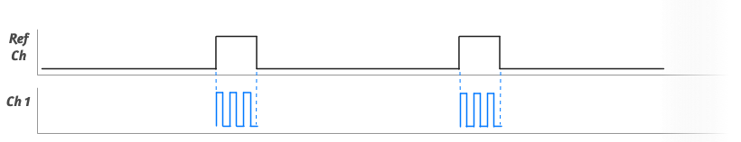
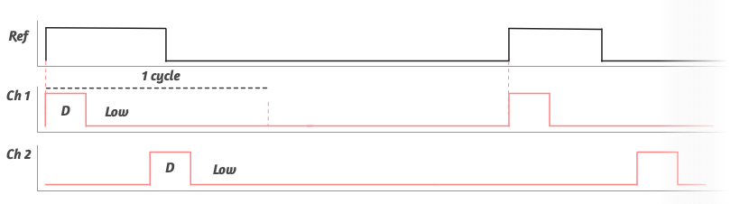

import Link from "next/link";

# The HackPWM Platform

### Concept

The basic idea is to allow the user to create powerful PWM Systems with a small, but flexible set of Program Blocks which can depend on other signals, so it can provide continuous PWM signal output, signal cascading, phase shifting, signal counting etc.

#### Pins

Which pins can be used for what.

- `OUTx` Pins: **OUT1**, **OUT2**, **OUT3**, **OUT4**, **OUT5**, **OUT6** can be used as `pin`, `wait_pin` and `count_pin` with internal programs. But external signals can not be applied to those pins.
- `GP0x` Pins: **GP02**, **GP03**, **GP04** can also be used as well as `pin` and as `wait_pin` / `count_pin` for external signal sources. Keep in mind, that `GP0x` pins have only 3.3V output voltage and should be used to drive signals only. If using as inputs for external signal sources, they must be protected appropriately. The engineer should maintain an input voltage at about 3.3V. For more info see [RP2040 Datasheet](https://datasheets.raspberrypi.com/rp2040/rp2040-datasheet.pdf) 5.5.3. **Pin Specifications**.

--- 

#### Built-in Program Blocks

We are going to explore the built-in program blocks, but custom program blocks can also be created by more advanced users.
See source code: https://github.com/webdeb/nanoshim/blob/hackpwm/src/hackpwm/programs.py

### PWM - Program

- `pid` = "PWM"

**Configugration parameters:**

- `label` The name of the program, "F1", "My PWM 1" ..

- `pin` The signal out pin

- `wait_pin` (optional) The pin which enables the PWM Program to run a full cycle. `wait_pin` can be one of the **OUTx** pins, and also the GPIO pins like `GP02`, `GPO3`, `GPO4` for external signal sources, like feedback loops etc.

- `wait_level` (optional, default=1) The level of the `wait_pin` which enables the PWM.

**UI Settings:**

- **F:** The frequency of the signal. Up-to 25Mhz (with **wait_pin**: 20.8 Mhz)
- **D:** The duty cycle. From 16ns. Can be set to **%** or **absolute time** by holding the **MODE** Button.

##### Examples:

The output depends on the actual settings in the UI, like the frequency and the duty cycle. The following examples are just for demo purposes.

###### Basic PWM


```json
{
  "title": "Simple PWM System",
  "programs": [
    { "pid": "PWM", "label": "F1", "pin": "OUT1" }
  ]
}
```

###### PWM with `wait_pin`



With an internally controlled pin

```json
{
  "title": "PWM with Ref",
  "programs": [
    { "pid": "PWM", "label": "Ch1", "pin": "OUT1", "wait_pin": "OUT2" },
    { "pid": "PWM", "label": "Package", "pin": "OUT2" }
  ]
}
```

Or an external pin as input.

```json
{
  "title": "PWM with Ref",
  "programs": [
    { "pid": "PWM", "label": "F1", "pin": "OUT1", "wait_pin": "GP02" }
  ]
}
```

---

### PUSH PULL - Program

- `pid` = "PUSH_PULL"

The Push Pull program is almost the same as PWM Program and supports the same configuration parameters, but differs from the **PWM** program only as it runs first the full period for the configured `pin` and then it runs the same period for `pin+1`. This is why you should pay attention which `pin` you configure.

**Configuration parameters:**

- `label` like **Push Pull**, **H-Bridge** or **CH12**..

- `pin` The **first** signal out pin. Keep in mind, that the **PUSH PULL** Program will acquire _pin+1_ automatically.

- `wait_pin` (optional) The pin which enables the PWM Program to run a full cycle

- `wait_level` (optional, default=1) The level of the `wait_pin` that enables the PUSH PULL Program.

**UI Settings:**

Same as PWM, but the max frequency is only about 12.5Mhz because of the double PIN process.

#### Examples:

The output depends on the actual settings in the UI, like the frequency and the duty cycle.

##### PUSH PULL


```json
{
  "title": "PushPull",
  "programs": [{ "pid": "PUSH_PULL", "label": "Push Pull", "pin": "OUT1" }]
}
```

##### PUSH PULL with `wait_pin`



_The program will end its cycle, before it is going to wait mode again._

```json
{
  "title": "PushPull",
  "programs": [
    { "pid": "PUSH_PULL", "label": "Push Pull", "pin": "OUT1", "wait_pin": "OUT3" },
    { "pid": "PWM", "label": "Mod", "pin": "OUT3" }
  ]
}
```

### PHASE PULSE - Program

The Phase Pulse program requires a reference signal `wait_pin`. When the configured level of the reference signal is available, it will wait for **x** cpu cycles and then change to high for **y** cpu cycles. Before closing its cycle, it will wait for the inverted `wait_level` so it assured that the Phase Pulse Program runs only once, for each period of the ref signal. To perform multiple pulses, one could use a `PWM` signal with the `wait_pin` referencing the Phase Pulse signal. This is a first-class feature, so the Phase Pulse Program offers `count_pin` configuration option, which allows the user to set the amount of pulses it should be in high mode.

- `pid` = "PHASE_PULSE"

Configugration parameters:

- `label` (optional)

- `pin` the output pin

- `wait_pin` The pin which starts the program cycle.

- `wait_level` (optional, default=1) The level of the `wait_pin` which starts the cycle.

- `count_pin` (optional) If set, the user can change the **amount of pulses** of the referenced pin, instead of the usual duty cycle as absolute time.

UI Settings:

- **Phs**: Defines the phase or delay, before the `pin` goes into high state.
- **D**: This is time the pin is in its high state.
- OR **Count**: If `count_pin` configuration is used, the program will start its duty cycle and count the on-off states of the `count_pin` before it goes to low.

#### Examples

The examples are just for demonstration purposes, and depend on the actual settings through the UI.

##### Basic usage


```json
{
  "title": "Phase Examp",
  "programs": [
    { "pid": "PWM", "label": "F1", "pin": "OUT1" },
    { "pid": "PHASE_PULSE", "label": "S1", "pin": "OUT2", "wait_pin": "OUT1" }
  ]
}
```

###### Long delay


_Same config as before, it just depends on the setting of the Phs param in the UI._

###### Same count as ref


_The program waits for the `wait_pin`, then delays, and then it stays in the high state as long it counts for 2 cycles (as an example) of the `count_pin`._


```json
{
  "title": "Phase Examp",
  "programs": [
    { "pid": "PWM", "label": "F1", "pin": "OUT1" },
    { "pid": "PHASE_PULSE", "label": "S1", "pin": "OUT2", "wait_pin": "OUT1", "count_pin": "OUT1" }
  ]
}
```

---

#### 4P System

At first glance the program seems to be complicated, but can be easily created using this basic set of primitives and it looks pretty simple and natural, once you understand the inner mechanics of  **The HackPWM Platform**.


```json
{
  "title": "4P",
  "programs": [
    { "pid": "PUSH_PULL", "label": "Push Pull", "pin": "OUT1" },
    { "pid": "PWM", "label": "Tesla", "pin": "OUT3", "wait_pin": "OUT4" },
    { "pid": "PHASE_PULSE", "pin": "OUT4", "wait_pin": "OUT1", "count_pin": "OUT3" }
  ]
}
```

--- 

### Upload Configuration to HackPWM

You can create multiple PWM Systems and upload them to the device. All of the Systems will preserve their state and be available after rebooting.

Connecting to the device and upload files to the board can be accomplished in many ways, for this demonstration I am using **uPIDE**, which is open source, very simple and is perfect for beginners.

You can download it here https://github.com/harbaum/upide/releases There are precompiled bundles for MacOS, Windows and Linux.

##### Example of uPIDE

1. Connect your HackPWM with the Computer over USB
2. Start the Program uPIDE

The program first searches for serial ports and after it has found the device it'll look similar to the next picture. In the bottom you will see the connected device, which should include the string HACKPWM, and on the left side you should see the configuration folder **store**.


3. Open the folder store and look for the file: `systems.json`. This configuration file contains all currently available PWM Systems and their configurations.


#### systems.json file

The default `/store/systems.json` includes the program **6xPWM**, **4P** and **2F AM**. It is using the integer numbers like&nbsp;`8` instead of `OUT1` which are internally mapped to the actual pin number. By reodering the objects in the list, you can change the order in which they appear in the **PWM Systems** Menu.
Here is the default file. You can use the following code as reference or to reset your device, if you made a mistake. So no problem.

```json
{
  "systems": [
    {
      "title": "6xPWM",
      "programs": [
        { "pin": 8, "label": "F1", "pid": "PWM" },
        { "pin": 9, "label": "F2", "pid": "PWM" },
        { "pin": 10, "label": "F3", "pid": "PWM" },
        { "pin": 11, "label": "F4", "pid": "PWM" },
        { "pin": 12, "label": "F5", "pid": "PWM" },
        { "pin": 13, "label": "F6", "pid": "PWM" }
      ]
    },
    {
      "title": "4P",
      "programs": [
        { "pin": 8, "label": "PushPull", "pid": "PUSH_PULL" },
        { "pid": "PWM", "wait_pin": 11, "pin": 10, "label": "Tesla" },
        { "pid": "PHASE_PULSE", "count_pin": 10, "pin": 11, "wait_pin": 8 }
      ]
    },
    {
      "title": "2F AM",
      "programs": [
        { "pin": 8, "label": "Mod", "pid": "PWM" },
        { "pid": "PWM", "wait_pin": 8, "pin": 9, "label": "F1" },
        { "pid": "PWM", "wait_pin": 11, "pin": 10, "label": "F2" },
        { "pid": "PHASE_PULSE", "count_pin": 10, "wait_pin": 8, "pin": 11 }
      ]
    }
  ],
  "version": 2
}
```

4. Make some changes to the file and click on the save icon.


5. When changes are saved uPIDE will show a small message


6. Restart HackPWM by clicking on the **RESET** Button, you should now see the changes in you PWM System.

7. Done and enjoy!

For any questions, send an email to mail@plusminus.club or contact me via [Telegram](https://t.me/hackpwm_order_bot)
