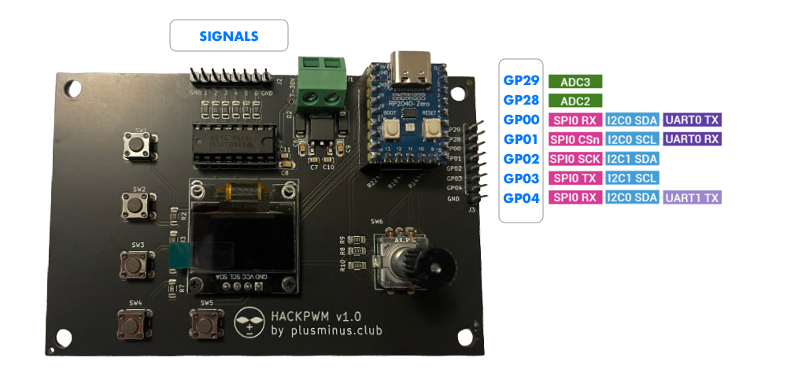
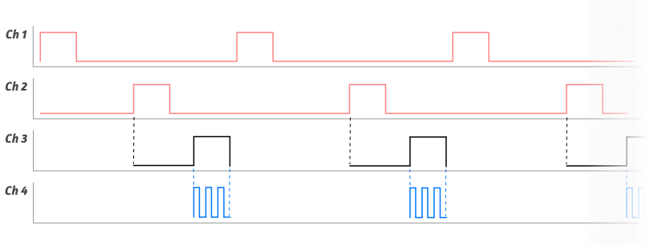

# HackPWM

## General information

HackPWM is a multipurpose dev board based on the RP2040 microcontroller.
As a bare metal hardware device it includes the RP2040, an ALPS Encoder, 5 Push Button and OLED 64x128 Display.
For PWM purposes it also has a dedicated Output Buffer chip to provide a stable output voltage of 5V and secure the microcontroller gpio pins from backpropagation voltage from switching power parts (like from inductive loads, etc). It also provides 7 GPIO pins for free use in custom user programs, 2 of those pins can be used as ADC, I2C and UART are also possible.

The included software stack allows to write simple and yet powerful programs very quickly. The underlying framework allows the developer to access all pins, input events and display in an advanced (max freedom) and a simple, convenient way. For example by using predefined program structures.

Some of the key feature here to mention:

- Configuration Storage
- Events accessing
- Render routines
- A reactive view = f(data) paradigm, which allowes to write very stable and reliable software.

As all the code is open source, devs are welcomed to provide their classes and sets of behavior flows for the community.
https://github.com/webdeb/nanoshim/tree/hackpwm

### PWM Specs

- 32 bit PWM counter length for each low and high period.
- 7.35 ns – 10 ns step size depending on the CPU clock speed

These are the basic specs of PWM possibilities, however, HackPWM is а flexible device and with the provided software it can create fairly complex signal logic for special purpose systems.
One of the programs and the underlying logic is illustrated below:

### Example PWM System

The 4P System (Push-Pull Pulse-Package) is a set of 4 PWMs Channels to fulfill the following needs:
Safe switching of 2 Push Pull power commutators, phaseshift-package channel, and a HF Pulse channel which gets enabled by the phase-package channel.

_Ch1 and Ch2 represent the Push Pull channels. Ch3 is an inverted channel which depends on one of the pushpull channels as inputs to run (can be configured) Ch4 dependson Ch3 as **input**.
Its worth mentioning, that an input could also be an external signal provided on one of the available GPIO pins, the hardware provides._

The purpose of this program is to demonstrates the flexibility of the underlying stack how it can create complex signal cascading.
Go to the documentation page and read more about it.
