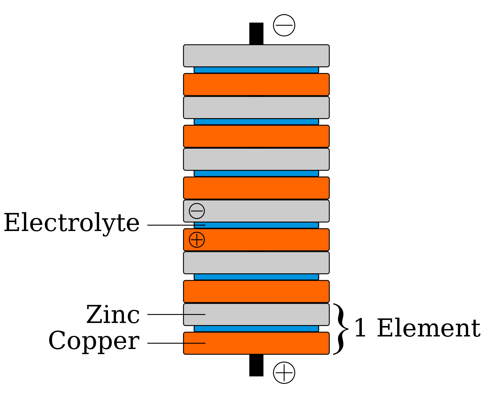

# The Voltaic Pile: Unleashing the Power of Volta's Invention

The Voltaic pile, invented by Alessandro Volta in 1800, stands as a significant milestone in the history of electricity. This revolutionary device, also known as the Voltaic cell or battery, unlocked new possibilities for harnessing electrical energy. In this article, we will explore the Voltaic pile, its construction, working principle, and the impact it had on the development of electrical science.

## Understanding the Voltaic Pile

The Voltaic pile is a simple but powerful device that generates a continuous flow of electric current through a chemical reaction. It consists of alternating layers of two dissimilar metals, usually zinc and copper, separated by discs of cardboard soaked in an electrolyte solution, typically saltwater or dilute acid.

## Construction

To construct a Voltaic pile, one begins by placing a disc of zinc metal on a solid base. On top of the zinc disc, a cardboard soaked in the electrolyte solution is placed. Next, a disc of copper is stacked on the cardboard, followed by another soaked cardboard. This layering process continues, alternating zinc and copper discs with wet cardboards until the desired height is achieved.

## Working Principle

The Voltaic pile operates based on the principle of electrochemical reactions. When the two dissimilar metals, zinc and copper, come into contact with the electrolyte solution, an electrochemical cell is formed. This cell consists of two half-cells: the zinc half-cell and the copper half-cell. The electrolyte solution acts as a medium for ion transfer between the two half-cells.

Within the Voltaic pile, a chemical reaction occurs at the interface of each zinc-copper pair. The zinc metal, being more reactive, undergoes oxidation, releasing electrons. These electrons flow through an external circuit, creating an electric current. At the copper side of each pair, reduction takes place, balancing the overall electrochemical reaction. This continuous flow of electrons constitutes the electric current produced by the Voltaic pile.

## Impact and Significance

Alessandro Volta's invention of the Voltaic pile was a breakthrough in electrical science. It marked the first time that a device could generate a steady flow of electric current. The Voltaic pile laid the foundation for the development of modern batteries, which have become indispensable in countless applications, from powering portable electronics to enabling electric vehicles.

Volta's invention also provided experimental evidence supporting the concept of electricity as a dynamic force rather than a mere static phenomenon. It sparked further research and exploration in the field of electrochemistry, leading to significant advancements in understanding chemical reactions and electrical energy conversion.

## Conclusion

The Voltaic pile, invented by Alessandro Volta, revolutionized the world of electricity. This simple but powerful device demonstrated the possibility of generating a continuous flow of electric current through chemical reactions. The Voltaic pile opened new frontiers in electrical science and paved the way for the development of modern batteries and other electrical power sources. Its impact on technological advancements is immeasurable, and Volta's invention continues to shape the way we harness and utilize electrical energy today.
