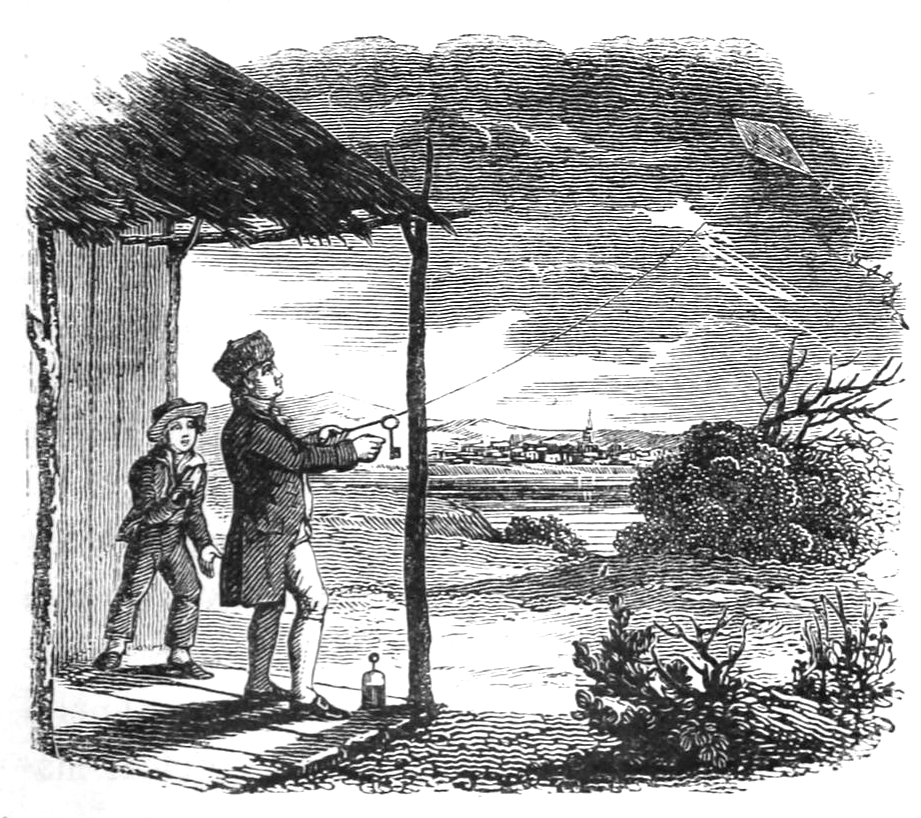

import Image from "next/Image";

# The Kite Experiment

The Kite Experiment conducted by Benjamin Franklin is a renowned scientific endeavor that played a crucial role in understanding the nature of electricity and establishing the connection between lightning and electrical charge. This daring experiment, conducted in 1752, remains an iconic moment in the history of science.

## Unveiling the Secrets of Lightning

Franklin's curiosity led him to contemplate the nature of lightning and its potential relationship to electricity. With a desire to unravel this mystery, he conceived the idea of conducting an experiment using a kite.

## The Setup: A Kite and a Key

In the Kite Experiment, Franklin constructed a simple kite using a large silk handkerchief attached to a lightweight wooden frame. To the top of the kite, he affixed a metal key, which was connected to a thin metal wire. The other end of the wire was held by Franklin, who stood on the ground.

## The Flight of the Kite

On a stormy day, Franklin launched his kite into the air, eagerly awaiting the outcome of his experiment. As thunderclouds rolled in, the wet string of the kite became a conductor of electricity, effectively drawing electrical charge from the atmosphere.

## The Discovery: Electric Charge in the Key

As the experiment progressed, Franklin noticed something remarkable. When he brought his hand close to the key, he experienced an electric shock, demonstrating the presence of electrical charge stored in the metal key. This revelation confirmed Franklin's hypothesis that lightning was a form of electrical discharge.

## Contributions to Understanding Electricity

The Kite Experiment was a significant milestone in the study of electricity. It provided evidence that lightning and electricity were related phenomena, contributing to the understanding of electrical charge and its behavior. Franklin's findings paved the way for advancements in the field of electricity and led to further investigations on lightning conductors and lightning rod systems.

## Safety Precautions and Ethical Considerations

It is important to note that Franklin conducted the Kite Experiment with great caution and adherence to safety measures. He used a silk string to insulate himself from the electric shock and ensured that the kite did not become a lightning rod by avoiding direct contact with the cloud-to-ground discharge.

## Impact and Legacy

The Kite Experiment was a pivotal moment in the history of science, marking a significant step forward in our understanding of electricity and lightning. Franklin's pioneering experiment provided the foundation for the development of lightning protection systems and helped shape our modern understanding of electrical phenomena.

The courage and intellectual curiosity demonstrated by Benjamin Franklin in conducting the Kite Experiment continue to inspire scientists and researchers to explore the mysteries of the natural world. This iconic experiment serves as a reminder of the power of observation, experimentation, and the relentless pursuit of knowledge.

In conclusion, the Kite Experiment conducted by Benjamin Franklin stands as a testament to human ingenuity and scientific exploration. It unlocked new realms of understanding, forever linking electricity and lightning and leaving an indelible mark on the annals of scientific discovery.
