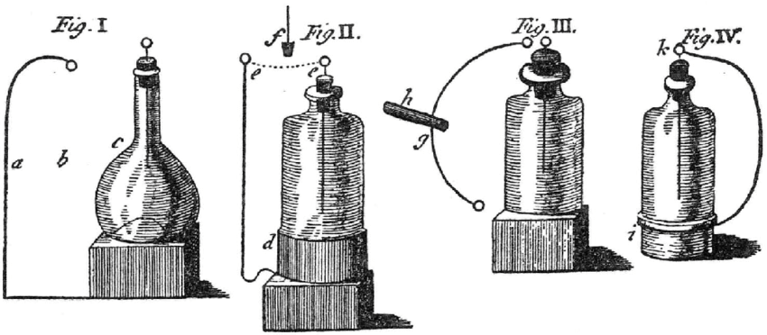

# The Leyden Jar Experiment

The Leyden Jar Experiment stands as a pivotal moment in the history of electricity. Developed by Pieter van Musschenbroek and further explored by scientists like Benjamin Franklin, this experiment marked a significant milestone in our understanding of electrical charge storage and discharge.

## The Leyden Jar: A Device of Electrical Power

The Leyden jar, a device invented in the mid-18th century, served as one of the earliest methods for storing and releasing static electricity. It consisted of a glass jar or bottle partially filled with water and equipped with two conductive coatings. The inner coating, typically made of metal foil or wire, was connected to a metal rod extending through an insulating stopper. The outer coating made contact with the outer surface of the jar. Together, these elements formed a capacitor capable of storing electrical charge.

## Charging the Leyden Jar

To perform the Leyden Jar Experiment, the jar needed to be charged with electricity. This could be achieved using various methods, such as an electrostatic generator or by exposing the jar to an external electrical source. When the jar was charged, the inner coating accumulated an electrical charge, while the outer coating remained neutral.

## The Release of Stored Electricity

One of the most intriguing aspects of the Leyden Jar Experiment was the ability of the jar to store a substantial amount of electrical charge. This stored energy could be discharged on command by creating a conducting path between the inner and outer coatings. When this discharge occurred, a sudden release of stored electricity took place, often accompanied by a visible spark and a crackling sound.

## Contributions to Electrical Understanding

The Leyden Jar Experiment played a crucial role in early electrical investigations, enabling scientists to study and comprehend the properties and behaviors of electric charge. It facilitated the exploration of various electrical phenomena, including the study of capacitance, the effects of static electricity, and the nature of electric shocks.

## Benjamin Franklin and the Leyden Jar

Benjamin Franklin, in particular, conducted extensive research with Leyden jars, furthering our understanding of electricity. His experiments with these devices led to significant discoveries, including his concept of positive and negative electrical charges. Franklin's utilization of Leyden jars in his investigations on electricity was instrumental in his groundbreaking contributions to the field.

## Legacy and Impact

The Leyden Jar Experiment served as a catalyst for the development of more advanced electrical storage devices, including modern capacitors. It sparked further research and experimentation in the field of electricity, paving the way for significant advancements in electromagnetism and the practical applications of electrical power.

The Leyden Jar Experiment remains a testament to the inquisitive spirit and scientific curiosity of early pioneers in the study of electricity. It contributed greatly to the foundation of electrical science and played a vital role in shaping our understanding of this fundamental force of nature.

In conclusion, the Leyden Jar Experiment stands as a monumental milestone in the journey of unlocking the secrets of electricity. Its significance in the realm of scientific discovery cannot be overstated, and its impact continues to resonate in the fields of physics and electrical engineering to this day.
