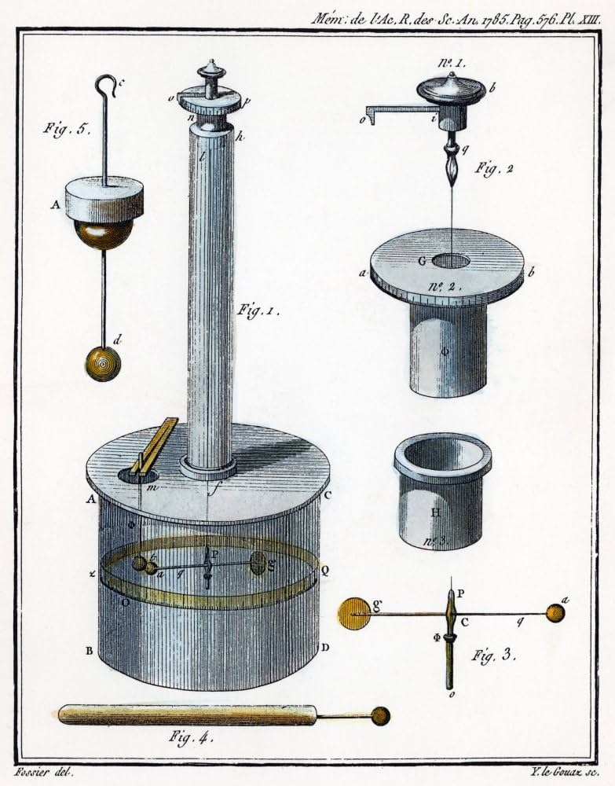

# The Torsion Balance Experiment: Unveiling the Secrets of Electrostatic Forces

The Torsion Balance Experiment, a remarkable scientific investigation, played a pivotal role in unraveling the mysteries of electrostatic forces. This groundbreaking experiment, conducted by several notable scientists throughout history, provided crucial insights into the nature of electric charges and the forces they exert on one another. Let's delve into the details of the Torsion Balance Experiment and its significant contributions to our understanding of electrostatics.

## Setting the Stage

The Torsion Balance Experiment involves the use of a delicate apparatus consisting of a horizontal bar or wire suspended by a thin fiber or thread at its center. At each end of the bar, small objects with known electric charges are attached. The experiment relies on the principle of torsion, which allows the bar to twist or rotate when subjected to an electric force.

## Coulomb's Pioneering Work

The experiment owes its name to Charles-Augustin de Coulomb, the French physicist who pioneered the study of electrostatic forces. In the late 18th century, Coulomb conducted a series of precise measurements using the torsion balance apparatus. He observed the twisting motion of the bar and carefully measured the forces required to maintain the balance.

## Quantifying Electrostatic Forces

Coulomb's meticulous measurements led him to formulate Coulomb's law, which describes the relationship between the magnitude of electrostatic forces and the distance and charges involved. He discovered that the force between two electric charges is directly proportional to the product of their magnitudes and inversely proportional to the square of the distance between them. This fundamental law laid the foundation for understanding the behavior of electric charges and became a cornerstone of electrostatics.

## Subsequent Advancements

Building upon Coulomb's work, other scientists continued to refine and expand the Torsion Balance Experiment. Notably, Henry Cavendish, a British physicist, employed an improved apparatus to measure the gravitational constant and the density of the Earth. His groundbreaking experiments with the torsion balance led to significant advancements in multiple fields, including physics, astronomy, and geophysics.

## Contributions to Modern Physics

The Torsion Balance Experiment has played a vital role in our understanding of electrostatic forces and their impact on the behavior of electric charges. It has enabled scientists to measure and quantify these forces with remarkable precision. The experiment's findings have not only enhanced our understanding of fundamental principles but have also laid the groundwork for numerous technological advancements.

## Applications and Impact

The knowledge gained from the Torsion Balance Experiment has had far-reaching applications. It has contributed to the development of electrical systems, electromagnetic technologies, and the design of sensitive instruments. Furthermore, it has influenced diverse areas such as particle physics, astrophysics, and the study of fundamental forces.

## Conclusion

The Torsion Balance Experiment stands as a testament to human curiosity, ingenuity, and the relentless pursuit of knowledge. Through this experiment, scientists like Coulomb and Cavendish unraveled the mysteries of electrostatic forces, paving the way for our understanding of electric charges, Coulomb's law, and the intricate interplay between electric forces and matter. The Torsion Balance Experiment remains a cornerstone of modern physics, inspiring generations of scientists to delve deeper into the intricate workings of the natural world.
