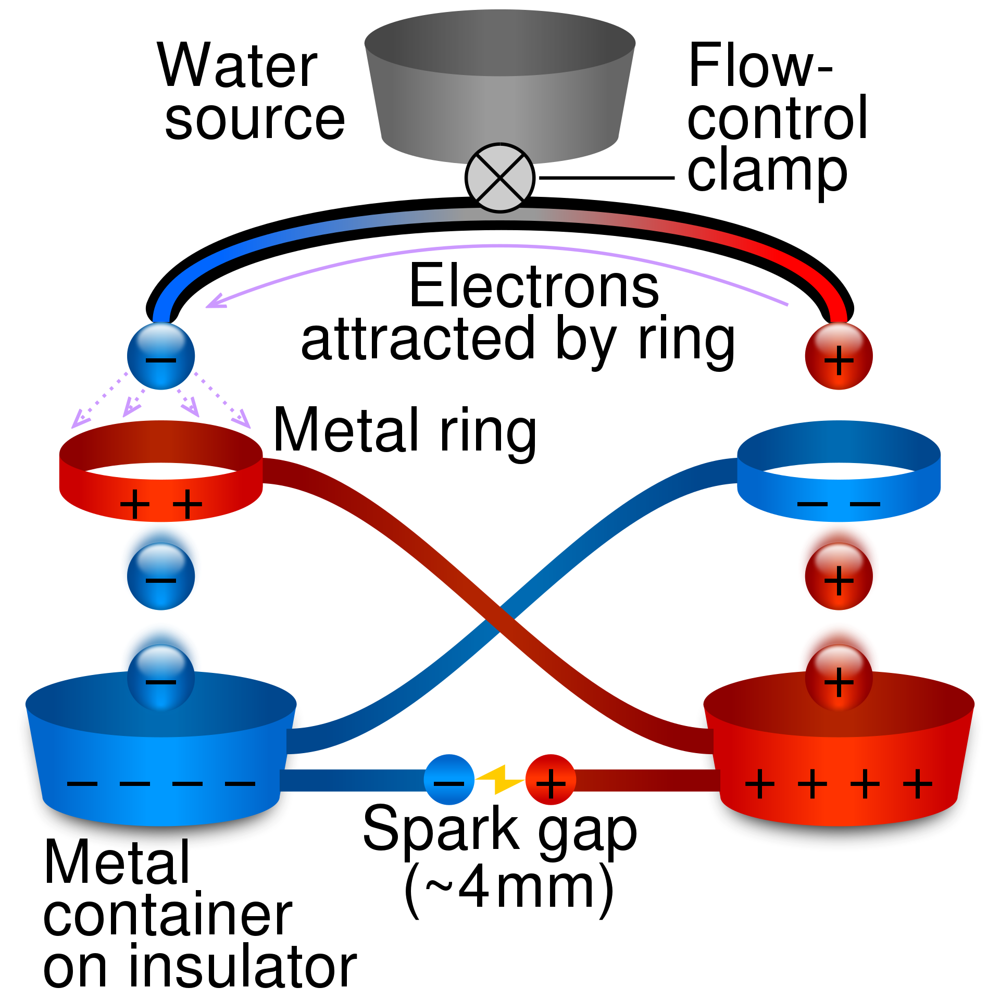

# The Kelvin's Dropper: Exploring Electrostatic Phenomena with Charge Separation

The Kelvin's Dropper is a captivating electrostatic device that demonstrates the principles of charge separation and voltage amplification. Invented by William Thomson, 1st Baron Kelvin, this ingenious apparatus showcases the fascinating behavior of electric charges and their ability to generate significant voltage differences. Let's explore the intricacies of the Kelvin's Dropper and delve into its remarkable properties and applications.

## Unleashing Electrostatic Potential

The Kelvin's Dropper consists of a vertical column with three metal spheres suspended at the top. Each sphere is connected to an electrode, and an initial voltage is applied to the system. When the device is in its neutral state, no significant activity is observed.

## The Dropper's Phenomenon

To initiate the phenomenon, a temporary connection is made between the bottom two spheres, allowing charges to redistribute. This redistribution creates an electric field that induces an opposite charge on the top sphere, resulting in charge separation.

## Voltage Amplification

Once the temporary connection is removed, the charges on the spheres remain separated, resulting in a potential difference. As a consequence of charge imbalance, a significant voltage difference is established across the spheres, leading to voltage amplification.

## Exploring Electrostatic Effects

The Kelvin's Dropper provides a unique and visually compelling demonstration of electrostatic phenomena. By manipulating charge separation, the device highlights the behavior of electric charges and their ability to generate voltage differences. The amplification effect observed in the Kelvin's Dropper showcases the principles of electrostatic induction and charge redistribution.

## Practical Applications

While the Kelvin's Dropper is primarily used as an educational tool to demonstrate the principles of electrostatics, it also finds practical applications. The device can inspire students to explore electrostatic phenomena and encourage further research in the field. Additionally, it serves as a captivating visual aid in lectures and demonstrations, fostering an intuitive understanding of electrostatic effects.

## Conclusion

The Kelvin's Dropper offers a mesmerizing glimpse into the world of electrostatics, showcasing the behavior of electric charges and their ability to generate significant voltage differences. Whether used as an educational tool or a captivating demonstration, the Kelvin's Dropper exemplifies the fascinating aspects of electrostatic phenomena. Through charge separation and voltage amplification, this device continues to inspire curiosity and exploration in the realm of electrostatics.
